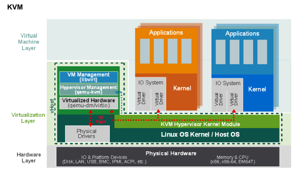

GNU/Linux permite virtualizar de forma nativa con un módulo denominado KVM, con las herramientas adecuadas como  QEMU y Libvirt nos permiten virtualizar sistemas operativos de manera sencilla y con en alto performance.

## ¿Qué es KVM?

KVM o _Kernel-based Virtual Machine_ es en **módulo del kernel de Linux que permite utilizar características de virtualización por hardware** ofrecidas por diferentes procesadores. KVM puede convertir a Linux en un hipervisor que permite que una máquina host ejecute entornos virtuales múltiples y aislados llamados máquinas virtuales (VM) o huéspedes.

## ¿Qué es QEMU?

Es un **emulador de máquinas virtuales** genérico open source que permite emular en sistema completo, incluidos periféricos y el espacio de usuario.

## ¿Que es Libvirt?
Conocida como _libvirt virtualization API_, es un **conjunto de herramientas para interactuar con las capacidades de virtualización** de las versiones recientes de Linux y otros sistemas operativos. 

Para tener un concepto mucho mas claro de esta herramienta, esta es capaz de gestionar diversas tecnologías de virtualización como KVM, Xen, VMware a traves de sus _managment tools_ .

## Implementación
- [kvm-01-install](kvm-01-install.md)
- [kvm-02-vm-creation](kvm-02-vm-creation.md)
- [kvm-03-vm-networking](kvm-03-vm-networking.md)
- [kvm-04-vm-storage](kvm-04-vm-storage.md)
- [kvm-05-vm-snapshot](kvm-05-vm-snapshot.md)
- [kvm-06-vm-profiles](kvm-06-vm-profiles.md)

## Ejemplitos
- [Here](examples/)